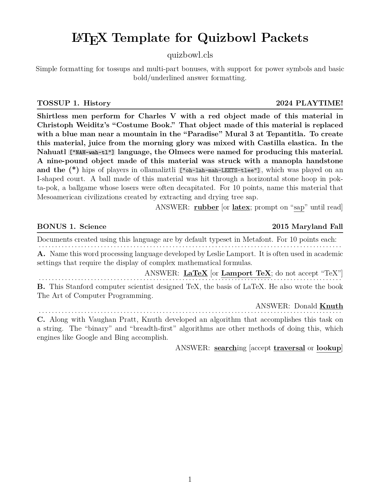

# quizbowl.cls

LaTeX template for easily creating neatly formatted quizbowl packets. The idea is to simplify the process of drafting quizbowl questions. See the Usage and Example sections below. Made hastily to test out some things in LaTeX.

[Generate a random packet with this notebook](https://colab.research.google.com/github/kevinferg/quizbowl-latex-template/blob/main/quizbowl-packet-generator.ipynb). (This is made possible via the [qbreader python module](https://github.com/qbreader/python-module))

#### Example:

<p align="center">
  
</p>


## Usage

Begin a .tex file with: `\documentclass{quizbowl}`


#### Environments:
- Tossups: 
```latex
\begin{tossup}
    \category{}
    \question{}
    \answer{}
\end{tossup}
```

- Bonuses:
```latex
\begin{bonus}
    \category{}
    \intro{}
    \question{}    \answer{}
    \question{}    \answer{}
    \question{}    \answer{}
\end{bonus}
```


#### Formatting:

- Questions:
  - **Text prior to a power symbol (\*)**, if it is present, is bolded.
  - Text inside brackets is specially formatted, i.e. for pronunciation `["pro-NUN-see-AY-shun"]` help.
- Answers:
  - Text within \*asterisks\* is bold and underlined: for acceptable (partial) answers.
  - Text within \~tildes\~ is just underlined: for answers to prompt.


#### Title/header info:
- `\tournament{Tournament Name}` -- Also appears as left header after page 1
- `\round{Packet number}` -- Also appears as right header after page 1
- `\description{Description/author info}`


#### Example:

The code below, from [main.tex](main.tex), was used to generate the simple example seen in this readme.

```latex
\documentclass{quizbowl}

\tournament{\LaTeX\;Template for Quizbowl Packets}
\round{quizbowl.cls}
\description{Simple formatting for tossups and multi-part bonuses, with support for power symbols and basic bold/underlined answer formatting.}


\begin{document}
\maketitle


\begin{tossup}
    \category{History \hfill 2024 PLAYTIME!}
    \question{Shirtless men perform for Charles V with a red object made of this material in Christoph Weiditz's "Costume Book." That object made of this material is replaced with a blue man near a mountain in the "Paradise" Mural 3 at Tepantitla. To create this material, juice from the morning glory was mixed with Castilla elastica. In the Nahuatl ["NAH-wah-tl"] language, the Olmecs were named for producing this material. A nine-pound object made of this material was struck with a manopla handstone and the (*) hips of players in ollamaliztli ["oh-lah-mah-LEETS-tlee"], which was played on an I-shaped court. A ball made of this material was hit through a horizontal stone hoop in pok-ta-pok, a ballgame whose losers were often decapitated. For 10 points, name this material that Mesoamerican civilizations created by extracting and drying tree sap.}
    \answer{*rubber* [or *latex*; prompt on "~sap~" until read]}
\end{tossup}


\begin{bonus}
    \category{Science \hfill 2015 Maryland Fall}
    \intro{Documents created using this language are by default typeset in Metafont. For 10 points each:}
    \question{Name this word processing language developed by Leslie Lamport. It is often used in academic settings that require the display of complex mathematical formulas.}
    \answer{*LaTeX* [or *Lamport TeX*; do not accept "TeX"]}
    \question{This Stanford computer scientist designed TeX, the basis of LaTeX. He also wrote the book The Art of Computer Programming.}
    \answer{Donald *Knuth*}
    \question{Along with Vaughan Pratt, Knuth developed an algorithm that accomplishes this task on a string. The "binary" and "breadth-first" algorithms are other methods of doing this, which engines like Google and Bing accomplish.}
    \answer{*search*ing [accept *traversal* or *lookup*]}
\end{bonus}


\end{document}
```
